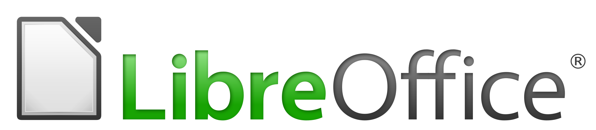
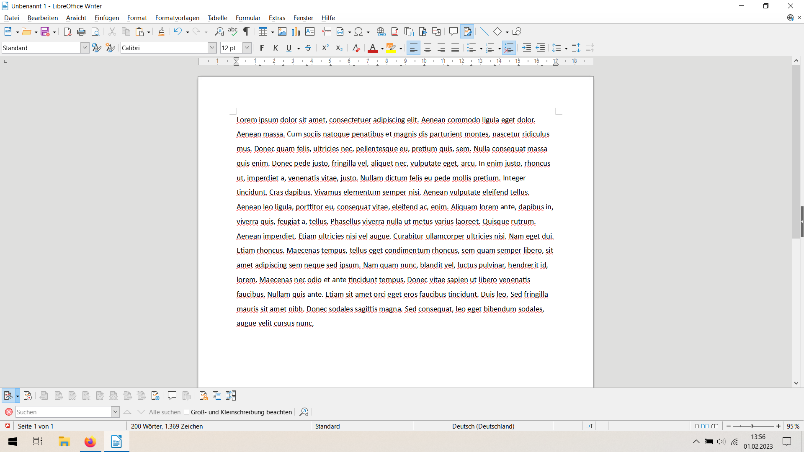
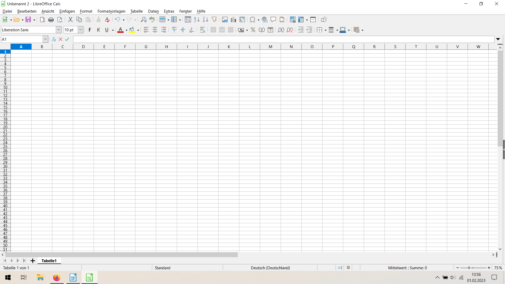
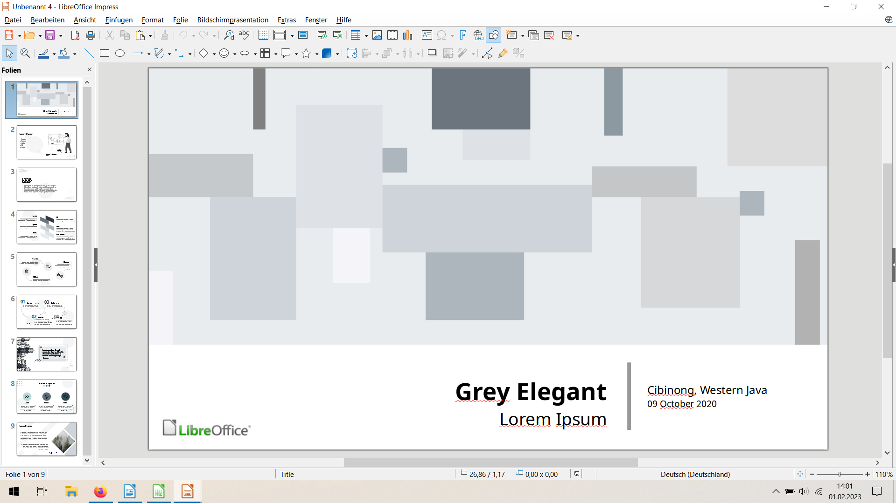
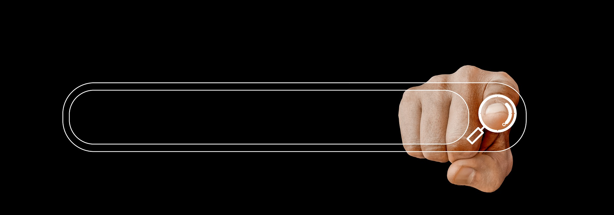
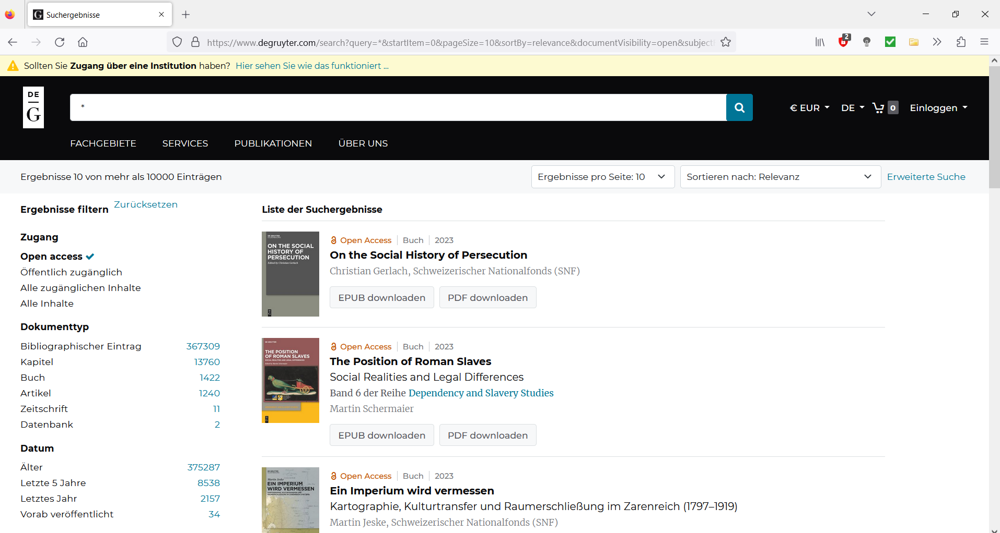

<!--
author:  Swantje Piotrowski, Lukas Eweleit, Erik Stoffer, Penelope Stibane, Caroline Beckmann, Arnold A. Willemer, Rebecca Brenner

email:    s.piotrowski@email.uni-kiel.de, stu217721@mail.uni-kiel.de, stu201059@mail.uni-kiel.de, stu210544@mail.uni-kiel.de, stu204392@mail.uni-kiel.de, stu203424@mail.uni-kiel.de

version:  0.0.1

@icon: https://www.uni-kiel.de/ps/cgi-bin/logos/files/cau/norm-de/cau-norm-de-lilagrey-rgb-0720.png

base: https://cloudlab-olathub.rz.uni-kiel.de/user/stu203424/106513175450593/liascript-preview/

language: de

narrator: Deutsch Female, Male

comment: Der digitale Baustein zu Digital Literacy  möchte Studierende  einen Überblick über künftige Schlüsselqualifikationen ermöglichen. Sie sollen verstehen, welche Kompetenzen künftige Berufs- und Arbeitsfelder erfordern und in der Lage sein, Digital Literacy in einem Lernprozess zu erfahren und zu beurteilen. Nach dieser Lerneinheit sollen Studierende  differenziert und reflektiert Tools und Software anwenden können.

# *LibreOffice* - was ist das?  

Bei *LibreOffice* handelt es sich um ein kostenfreies Open Source Softwarepaket. Die Bestandteile erfüllen ähnliche Funktionen wie die kostenpflichtigen, proprietären Pendants von *MicrosoftOffice*.  

Die Ursprungsversion des heutigen *LibreOffice* begann als Konkurrenzangebot zur Office Suite von *Microsoft*, allerdings ebenfalls als proprietäre - also herstellergebundene - Software. Nach verschiedenen Stationen war unter dem Namen *OpenOffice* eine Open Source-Variante entstanden, aus der schließlich in den frühen 2010er Jahren eine Abspaltung, das heutige *Libre Office*, hervorging. <a id="anker1" title="Vgl. Oualline/Oualline 2018, S. 27f.; LibreOffice: Chronik." href="#fn1">[1]</a>

-------------------------------------------
<li id="fn1"><a href="#anker1">[1]</a> Vgl. Oualline/Oualline: 27f.; LibreOffice: Chronik. </li>

## Was kann man damit machen? 

Die unterschiedlichen Bestandteile des *LibreOffice*-Pakets sind Writer, Calc, Impress, Draw, Base und Math. Für gängige Verwendungszwecke in Schule, Studium oder Beruf reichen häufig die ersten drei.   

+ **Writer** ist ein Textverarbeitungsprogramm wie Word. 

    + So kannst du beispielsweise mittels eines Videos lernen, darin eine [Dokumentvorlage](https://www.youtube.com/watch?v=hfvlGYd4Oko "Dokumentvorlage") zu         erstellen.

+ **Calc** ist ein Tabellenkalkulationsprogramm wie Excel.  

+ **Impress** ist ein Präsentationsprogramm wie PowerPoint. 

  

## Was spricht für *LibreOffice*?

Für die Verwendung von *LibreOffice* spricht für viele, dass es kostenlos ist. So erhalten mehr Menschen Zugang zu einem Tool, das in einer zunehmend digitaleren Welt wichtige Funktionen für den Arbeits- und Schulalltag erfüllen kann. 

Weitere Argumente dafür sind:  

+ die **Verfügbarkeit**: alle gängigen Betriebssysteme (Apple, Linux, Windows) werden bedient, auch Anwendungen für Tablets und Smartphones gibt es;  

+ die **Dateikompatibilität**: gespeichert wird in einem sogenannten OpenDocument-Format (.odt/.ods/.odp), das mit verschiedenen Betriebssystem vereinbar ist;
  
  + Möchtest du mehr über Dateiformate generell erfahren, kannst du [hier] klicken.

+ die **Erweiterungsmöglichkeiten**: mittels Plugins können die Funktionen einzelner Anwendungen erweitert werden, so zum Beispiel kann das Open Source-Literaturverwaltungsprogramm ['Zotero'](https://www.zotero.org/) in *LibreOffice*-Write eingebunden werden. <a id="anker2" title="Mehr Erweiterungen gibt es unter Libre Office: Extensions: https://extensions.libreoffice.org/ " href="#fn2">[2]</a>

> Falls du *LibreOffice* ausprobieren möchtest, kannst du es dir [hier](https://de.libreoffice.org/) herunterladen.  

-----------------------------------------------
<li id="fn2"><a href="#anker1">[2]</a> Mehr Erweiterungen gibt es hier unter Libre Office: Extensions: https://extensions.libreoffice.org/ </li>

## Welche Kritikpunkte gibt es? 

Wie man die Nutzung von *LibreOffice* wahrnimmt, hängt von vorherigen Kenntnissen und Gewohnheiten ab. Wegen der Verbreitung von *MicrosoftOffice* - beispielsweise am Arbeitsplatz, am Schul-PC oder per vergünstigter Lizenz über die Universität - setzen die zugehörigen Anwendungen für viele den Standard. 

Folgende Kritikpunkte können sich daraus ergeben:

 + die **Darstellung** ist eher funktional gestaltet als visuell ansprechend aufbereitet;

 + die **Bezeichnungen** für Menüs oder Befehle sind teilweise anders, sodass zum Beispiel für das Formatieren einer Seite andere Schritte notwendig sind; 

 + der **Support** bei *LibreOffice* läuft über Ressourcen im Internet wie Handbücher, Foren, Videos und so weiter - alle werden von der Community betreut. Für professionelle Betreuung gibt es auch Dienstleister:innen, die allerdings Gebühren erheben.  

 
# Open Source  

> **Starte eine Internetsuche zum Begriff Open Source. Nimm dir dafür fünf Minuten Zeit. Versuche anschließend, mit dem gesammelten Wissen das Quiz auf der nächsten Seite zu beantworten.** 

## Open Source - ein kurzes Quiz

Es können mehrere Antworten korrekt sein.  

**Open Source-Projekte bieten die Möglichkeit,** 

[[X]] für alle Menschen den Quellcode einzusehen. 
[[X]] für alle Menschen daran mitzuarbeiten. 
[[ ]] für alle Menschen nach eigenem Ermessen den Quellcode zu verändern. 

**Open Source Software ist**

[[ ]] immer kostenfrei. 
[[X]] nicht-proprietär. 
[[X]] frei zugänglich.

**Was ist sind bekannte Open Source-Softwares?**          

[[X]] *Mozilla Firefox*.
[[X]] *LibreOffice*.
[[ ]] *Adobe Photoshop*.

## Wie wird Open Source definiert? 

An der Frage nach dem Eigentum scheiden sich Open Source-Software und proprietäre Angebote. Eine proprietäre Software kennzeichnet sich dadurch, dass sie dem Hersteller gehört und Anwender:innen lediglich Nutzungsrechte erhalten. Open Source-Software hingegen ist nicht-proprietär, das Eigentum liegt bei der Allgemeinheit beziehungsweise den Anwender:innen. 
Das Aufkommen von proprietärer Software in den 1970er Jahren rief Kritik hervor. Nicht länger den Quellcode einsehen und damit auch nicht bearbeiten zu können, rief bei manchen Computerbegeisterten Unzufriedenheit hervor. Der Informatiker Richard Stallmann gründete, mit dem Zweck ein freies Gegenmodell zu schaffen, die *Free Software Foundation*.
	<a id="anker1" title="Vgl. Vaidhyanathan: 361." href="#fn3">[3]</a>
 Die Begeisterung und das Engagement für Open Source-Software verbreitete sich. Mittlerweile gibt es eine Vielfalt an Projekten, die auf den Grundlagen von Open Source aufbauen, darunter Größen wie Mozilla Firefox, Linux oder VLC Media Player. 

Basis für Open Source-Software sind mehrere Freiheiten
	<a id="anker1" title="Vgl. Open Source Initiative: The Open Source Definition." href="#fn4">[4]</a>
: 

+ der **Quellcode ist einsehbar**, was es allen Nutzer:innen erlaubt, die Software nachzuvollziehen, zu begutachten und auf Wunsch sowie in Übereinstimmung mit den bestehenden Richtlinien zu verbessern; 

+ die **Software ist frei zugänglich**, niemand wird also von der Verwendung ausgeschlossen; 

+ die **freie Weitergabe**, da die Rechte an der Software nicht bei einem Unternehmen liegen, sondern ein allgemeines Gut darstellt; 

+ das **Erstellen von Derivaten** ist erlaubt, allerdings müssen diese unter derselben Lizenz wieder veröffentlicht werden, was eine Verringerung der Rechte     verhindert. 

[Pizzadiagramm von Frank Fiedler] 

Viele Elemente finden sich ebenfalls in Modellen wieder, die zum Oberthema Digital Literacy herangezogen werden. Es geht darum, zu verstehen, wie etwas – ob Software oder Digitalität – funktioniert und sich daran beteiligen zu können. [Kollaboratives Arbeiten] und Kreativität sind gefragt, um ein Projekt voranzubringen. Open Source ist auf Gemeinschaft gestützt und auf deren Bedürfnisse ausgerichtet, dient dem Abbau von Barrieren und der Förderung Teilhabe.

----------------------------------------------------
<li id="fn3"><a href="#anker1">[3]</a> Vgl. Vaidhyanathan: 361.</li>
<li id="fn4"><a href="#anker1">[4]</a> Vgl. Open Source Initiative: The Open Source Definition. </li>

# Open Science oder, Offenheit in der Wissenschaft

Die Idee des freien Zugangs zu Inhalten lässt sich auf weitere Bereiche übertragen. Im Universitätsalltag könnte dir bereits Open Access begegnet sein. Bei der Suche nach Fachliteratur gibt es manche Titel, die frei im Internet zugänglich sind. Dafür musst du nicht mal im Uni-Netz eingeloggt sein. So kannst du dir beispielsweise beim Verlag *DeGruyter* gefiltert alle Open Access Publikationen im Bereich Geschichte anzeigen lassen. 

  

> **Ein umfassenderes Herangehen, das auf die Öffnung des wissenschaftlichen Prozesses im Ganzen mittels digitaler Technologien abzielt, ist Open Science.** 

## Was ist Open Science?

> "Der Begriff Open Science (Offene Wissenschaft) bündelt Strategien und Verfahren, die darauf abzielen, die Chancen der Digitalisierung konsequent zu nutzen, um alle Bestandteile des wissenschaftlichen Prozesses über das Internet offen zugänglich, nachvollziehbar und nachnutzbar zu machen. Damit sollen Wissenschaft, Gesellschaft und Wirtschaft neue Möglichkeiten im Umgang mit wissenschaftlichen Erkenntnissen eröffnet werden.“ [Open Science AG](https://ag-openscience.de/open-science/ "Open Science Definition")

Kommunikation zwischen Wissenschaftler:innen untereinander und in die Gesellschaft hinein ist dank den Möglichkeiten der Digitalisierung leichter geworden. Open Science hat zum Ziel, Barrieren in und zwischen verschiedenen Gruppen abzubauen und durch einen flüssigeren Austausch, Forschung effektiver und transparenter zu gestalten. Eine Offenlegung von Materialien aus dem gesamten Forschungsprozess - sei es Planung, Datenerhebung, Lehre oder Weiteres - wird dabei als zentral bewertet.

Dennoch gibt es Fragen nach rechtlichen Möglichkeiten der Veröffentlichung von gegebenenfalls sensiblen Daten; auch Sorge um den Klau eigener Leistungen und der zusätzliche Aufwand zur regelmäßigen Veröffentlichung des Arbeitsstands können bestehen. 
	<a id="anker1" title="Vgl. Heise: 107f." href="#fn5">[5]</a>

 Dies sind nur einige Umstände, die Wissenschaftler:innen daran hindern können, ihre Forschung nach Open Science-Prinzipien aufzustellen.   

-----------------------------------------------
<li id="fn5"><a href="#anker1">[5]</a> Vgl. Heise: 107f. </li>

## Zwischen Wunsch und Realität und Rechten

Das akademische Milieu selbst und außenstehende Einrichtungen stellen Forderungen nach und begründen Initiativen für eine Anwendung von Open Science-Prinzipien. So hat sich beispielsweise die *Helmholtz-Gemeinschaft Deutscher Forschungszentren e. V.*  – die größte Forschungsgemeinschaft in Deutschland dem Prinzip von Open Science verschrieben. Dies stellt für sie eine Ausweitung der bisherigen Open Access-Richtlinie dar.
	<a id="anker1" title="Vgl. Helmholtz: Open Science." href="#fn6">[6]</a>
 
Im Koalitionsvertrag für 2022-2027 des Landes Schleswig-Holstein wurde im Absatz zur Digitalisierung an Hochschulen für eine Ausweitung der bisherigen Open Access-Strategie plädiert. So soll diese um Open Science beziehungsweise Open Data ergänzt werden.
	<a id="anker1" title="Vgl. CDU/GRÜNE: 32." href="#fn7">[7]</a>
  
Konkrete Pläne, Gelder oder Mechanismen werden hingegen nicht benannt.

Neben Fragen nach Verbreitung, Anerkennung und Förderung von Open Science gibt es rechtliche Bedingungen, die geklärt werden müssen. Materialien aus der wissenschaftlichen Praxis können nur unter gewissen Bedingungen veröffentlicht werden, sollen sie als 'offen' gelten. Die Auswahl der Lizenz spielt somit eine Rolle. Unter den beliebten, häufig genutzten Creative Commons (CC) Lizenzen sind dies CC-BY, CC-BY-SA und CC-Zero. Sie erlauben alle die Weiterverwendung, wobei teilweise eine Namensnennung und bei Bearbeitung eine Veröffentlichung unter derselben Lizenz erforderlich ist.
	<a id="anker1" title="Vgl. OER: Was ist OER? " href="#fn8">[8]</a>
 

---------------------------------------------------------
<li id="fn6"><a href="#anker1">[6]</a> Vgl. Helmholtz: Open Science. </li>
<li id="fn7"><a href="#anker1">[7]</a> Vgl. CDU/GRÜNE: 32. </li>
<li id="fn8"><a href="#anker1">[8]</a> Vgl. OER: Was ist OER? </li>

## Was sind die Elemente von Open Science?

{{0}}
Vom wissenschaftlichen Prozess gelangen üblicherweise Ergebnisse an die Öffentlichkeit: ein Sammelband kann das Produkt eines Studienprojekts sein; bei einem Vortrag präsentieren Forschende die Dissertation; oder auch diese Lernbausteine zu Digital Literacy, die in Teilen das Resultat eines Seminars darstellen. 

{{1}}
Open Science möchte die Schritte des wissenschaftlichen Arbeitens zugänglich machen, statt lediglich Ergebnisse zu publizieren.
Doch welche Bereiche sind das genau?

{{2}}
+ **Open Data**
+ **Open Methodology**
+ **Open Source**
+ **Open Access**
+ **Open Educational Ressources (OER)**
+ **Open Peer Review**

-----------------------------------------

{{3}}
**Open Data** bezieht sich darauf, erhobene Forschungsdaten zu veröffentlichen. So können andere Wissenschaftler:innen diese einsehen, verwerten oder anhand derer Ergebnisse nachvollziehen. 

{{4}} 
**Open Methodology** verweist auf die gewählten und angewandten Methoden einer Forschung. Es gilt, diese in ihrer Anwendung zu dokumentieren und deren Auswahl für das Forschungsdesign zu begründen. 

{{5}}
**Open Source** legt eine Verwendung von Technologien (Hard- und Software) nahe, die nicht-proprietär sind. Durch einen freien Zugang könne mehr Menschen sich an Projekten beteiligen, die auf beispielsweise eine spezielle Software angewiesen sind. 

{{6}}
**Open Access** meint die Zugänglichkeit der Veröffentlichungen. Am Ende einer wissenschaftlichen Forschung steht häufig eine Publikation, meist in Textform. Ob Artikel oder Monografie, veröffentlicht wird häufig mittels Wissenschaftsverlagen. Diese organisieren und bestimmen nicht nur die Veröffentlichungen, sie haben auch rechtliche Ansprüche darauf.
	<a id="anker1" title="Vgl. Heise: 41." href="#fn9">[9]</a>
  Für Bücher – egal ob in physischer oder digitaler Form – muss von Interessierten gezahlt werden . Eine freie Veröffentlichung hingegen bedeutet, dass Inhalte nicht hinter einer ‚Paywall‘ stehen und allen kostenfrei zur Verfügung stehen. Die Bedeutung des freien Zugangs zu Informationen lässt sich auch an der Erwartung der *Deutschen Forschungsgemeinschaft (DFG)* sehen, die Publikationen von ihnen geförderten Projekten gerne in Open Access sehen möchte.
	<a id="anker1" title="Vgl. Heise: 51." href="#fn10">[10]</a>
  
 

{{7}}
**Open Educational Resources (OER)** sind für Lehre und Bildungsarbeit in verschiedenen Einrichtungen gedacht. Freie Lehrmaterialien können – unter Berücksichtigungen der Lizenzbedingungen – verwendet und gegebenenfalls auch verändert werden. Es kann so ein Austausch an Material entstehen und Vermittlungsansätze können verbessert werden. Nicht jede Unterrichtseinheit selbst erstellen zu müssen, spart außerdem Zeit.
	<a id="anker1" title="Vgl. OER: Was ist OER? " href="#fn11">[11]</a>

{{8}}
**Open Peer Review**: Austausch untereinander ist ein wichtiges Element von Wissenschaft. In formeller, schriftlicher Form geschieht dies bei Review-Verfahren. Die Forschung einer Person wird von ausgewählten Wissenschaftler:innen gesichtet und kommentiert. Dabei wird deren Nachvollziehbarkeit und Übereinstimmung mit wissenschaftlichen Standards überprüft. Ein Diskurs kann wegen der kleinen Anzahl der Reviewer:innen und dem geschlossenen Verfahren kaum entstehen. Bei einem Offenen Peer Review-Verfahren können prinzipiell alle Mitglieder der Community einen Beitrag dazu leisten. Auf Eigeninitiative basierend beteiligen sich Wissenschaftler:innen an der Begutachtung und erstellen Kommentare beziehungsweise Vorschläge, die anschließend veröffentlicht werden.
	<a id="anker1" title="Vgl. Heise: 64." href="#fn12">[12]</a>
  

---------------------------------------------
{{9}}
<li id="fn9"><a href="#anker1">[9]</a> Vgl. Heise: S. 41. </li>
<li id="fn10"><a href="#anker1">[10]</a> Vgl. Heise: 51. </li>
<li id="fn11"><a href="#anker1">[11]</a> Vgl. OER: Was ist OER? </li>
<li id="fn12"><a href="#anker1">[12]</a> Vgl. Heise: 64. </li>

# Literatur, Quellen und Abbildungen

Literatur und Quellen

+ CDU; GÜNE: Ideen verbinden. Chancen nutzen. Schleswig-Holstein gestalten. Koalitionsvertrag 2022-2027, URL: https://sh-gruene.de/wp-content/uploads/2022/06/Koalitionsvertrag-2022-2027_.pdf (letzter Zugriff am 27.02.23). 

+ Heise, Christian: Von Open Acces zu Open Science. Zum Wandel digitaler Kulturen der wissenschaftlichen Kommunikation, Lüneburg 2018. 

+ Helmholtz: Open Science, URL:  https://www.helmholtz.de/ueber-uns/unsere-werte/open-science/ (letzter Zugriff am 28.02.23).

+ LibreOffice: Chronik, URL: https://de.libreoffice.org/about-us/chronik/  

+ Libre Office: Extensions, URL: https://extensions.libreoffice.org/ (letzter Zugriff am 27.02.23).

+ LibreOffice - The Document Foundation: Dokumentvorlagen in Writer - LibreOffice 7.4 (German/Deutsch), URL: https://www.youtube.com/watch?v=hfvlGYd4Oko (letzter Zugriff am 28.02.23).

+ OER: Was ist OER?, URL: https://open-educational-resources.de/was-ist-oer-3-2/ (letzter Zugriff am 28.02.23).

+ Open Science AG: Open Science Defintion, URL: https://ag-openscience.de/open-science/ (letzter Zugriff am 28.02.23).

+ Open Source Initiative: The Open Source Definition, UR: https://opensource.org/osd/ (letzter Zugriff am 27.02.23).

+ Oualline, Steve; Oualline, Grace: Practical Free Alternatives to Commercial Software, Berkeley 2018.

+ Vaidhyanathan, Siva: Open Source as Culture - Culture as Open Source. 2005,in: Open Source Jahrbuch. Zwischen Softwareentwicklung und Gesellschaftsmodell, 2005, S. 359-366.

+ Zotero: Your personal research assistant, URL: https://www.zotero.org/ (letzter Zugriff am 28.02.23).

--------------------------------------------------------------------------------------------------------------
Abbildungen in Reihenfolge des Erscheinens:

+ LibreOffice: Logo unter CC-SA 3.0, URL: https://wiki.documentfoundation.org/File:LibreOffice_Initial-Artwork-Logo_ColorLogoBasic_2000px.png (letzter Aufruf: 28.02.2023).

+ Eigener Screenshot: LibreOfficeWriter.

+ Eigener Screenshot: LibreOfficeImpress.

+ Eigener Screenshot: LibreOfficeCalc. 

+ geralt: Searchbar unter einer Pixaby License, URL: https://pixabay.com/de/illustrations/suchleiste-suchfeld-eingabe-suche-4999181/ (letzter Aufruf: 28.02.2023).

+ Pexels: Code unter einer Pixaby License, URL: https://pixabay.com/de/photos/code-codierung-rechner-daten-1839406/ (letzter Aufruf: 28.02.2023).

+ Eigener Screenshot: DeGruyter Open Access Publikationen im Bereich Geschichte.

+ Frank Fiedler: Pizzadriagamm zu Digital Literacy.